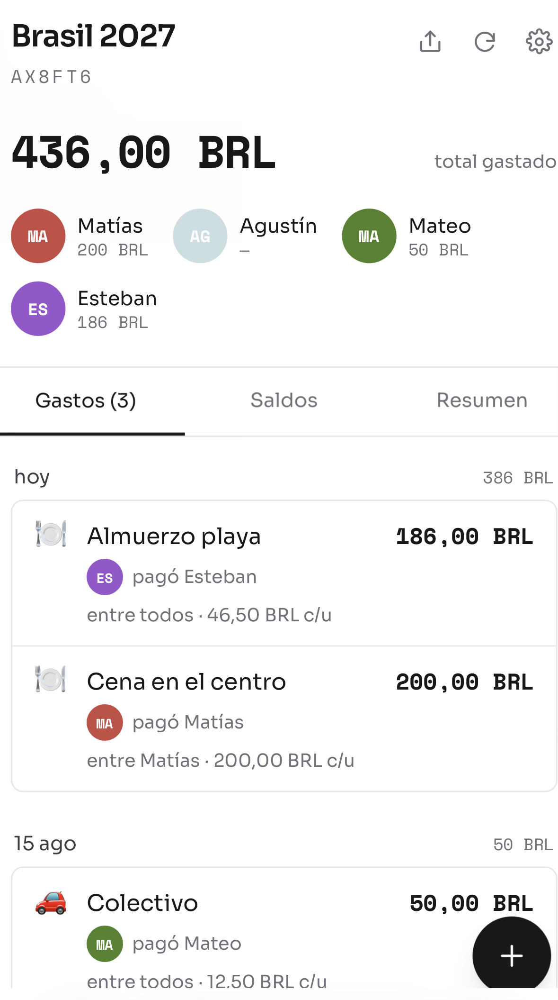
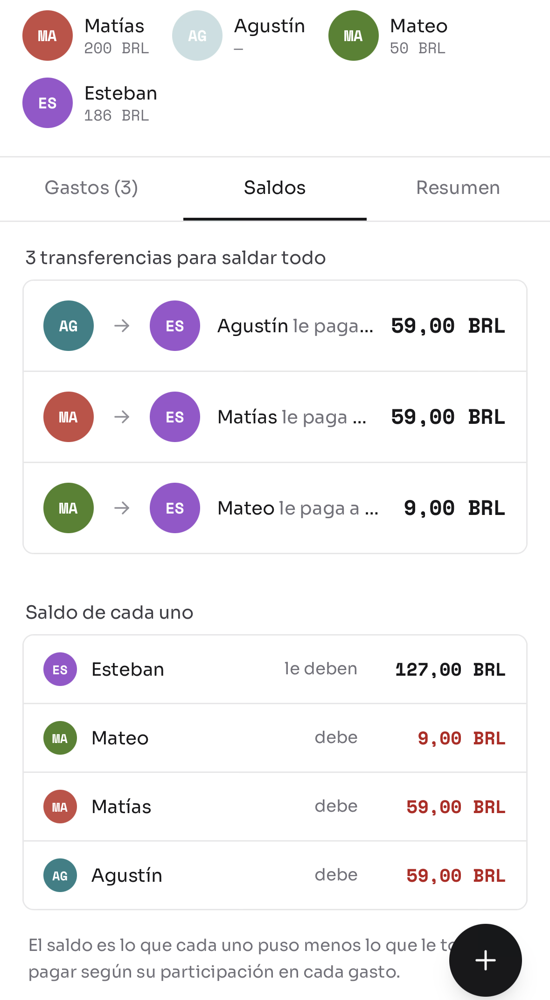
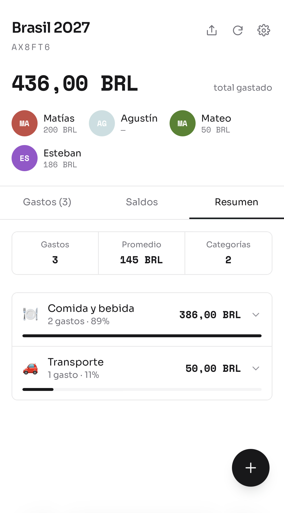
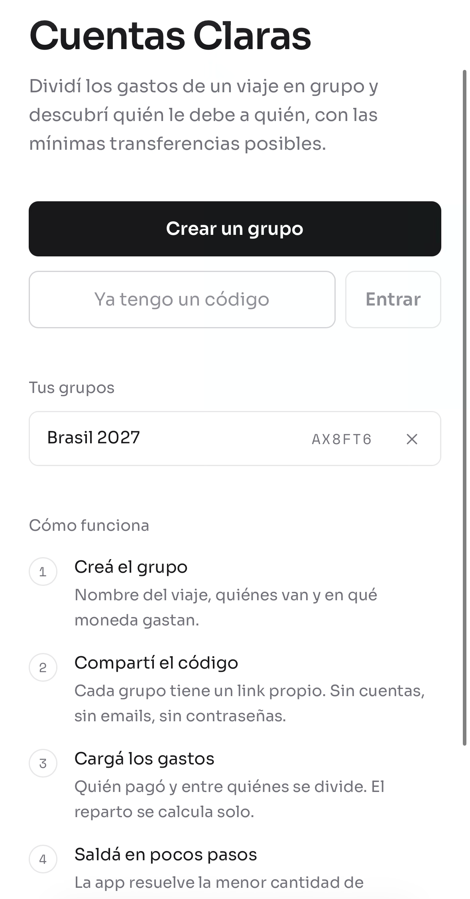
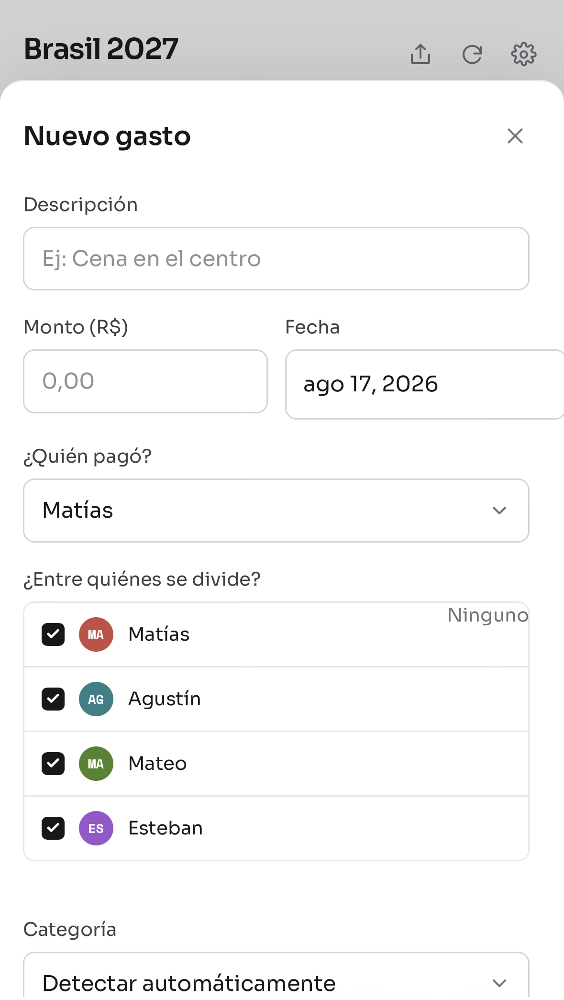
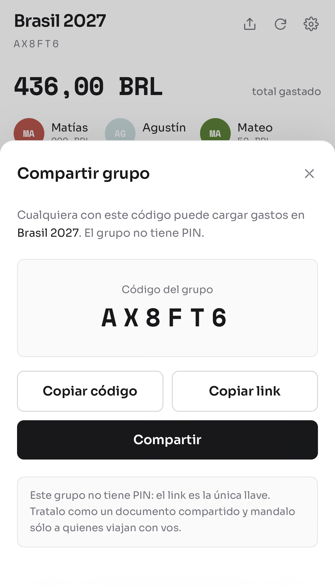

# Cuentas Claras

**Dividí los gastos de un viaje en grupo y descubrí quién le debe a quién, con las mínimas transferencias posibles.** Sin registro, sin emails: creás un grupo, compartís el código y todos cargan gastos desde su teléfono.


---

## Capturas

| Gastos                                          | Quién debe                                              | Stats                                              |
| ----------------------------------------------- | ------------------------------------------------------- | -------------------------------------------------- |
|  |  |  |

---

## Qué hace

- **Grupos por código compartible.** Creás un grupo y obtenés una URL tipo `/g/A7K2P9`. Se manda por WhatsApp y listo. Sin cuentas que crear.
- **PIN opcional.** Si el grupo lo lleva, se verifica contra un hash en el servidor y devuelve un token de sesión de 30 días.
- **División flexible.** Cada gasto registra quién pagó y entre quiénes se reparte; no tiene que ser todo el grupo.
- **Liquidación mínima.** En lugar de una matriz de "todos contra todos", la app calcula la lista más corta de transferencias que salda el viaje.
- **Categorización automática.** Infiere la categoría de la descripción por palabras clave, en español y en inglés. Siempre se puede corregir a mano.
- **Doble moneda.** Cada monto se puede mostrar convertido a una segunda moneda con la cotización que fija el grupo.
- **Pensado para el teléfono.** Es donde se cargan los gastos: en la mesa del restaurante.

El flujo completo son tres pasos:

| 1. Crear el grupo                                | 2. Cargar un gasto                               | 3. Compartir el código                       |
| ------------------------------------------------ | ------------------------------------------------ | -------------------------------------------- |
|  |  |  |

---

## Arquitectura

```
┌──────────────────────────────────────────────────┐
│  Cloudflare Worker  (cuentas-claras)             │
│                                                  │
│  /api/*  ──────────────►  router → validación    │
│                              │      → repo       │
│                              ▼                   │
│                         D1 (SQLite)              │
│                                                  │
│  todo lo demás  ──────►  assets estáticos        │
│                             (React)              │
└──────────────────────────────────────────────────┘
```

```
shared/           Contrato y dominio: usado por ambos lados
  types.ts          DTOs y límites de validación
  settlement.ts     Saldos y liquidación   ← el núcleo
  money.ts          Parseo y formateo de dinero
  categories.ts     Inferencia por keywords
  currencies.ts     Catálogo de monedas
  colors.ts         Paleta e iniciales de avatares

api/              Cloudflare Worker
  src/index.ts      Router y handlers
  src/repo.ts       Todas las queries a D1
  src/validate.ts   Validación de entrada
  src/crypto.ts     Códigos, PIN (PBKDF2), tokens (HMAC)
  src/http.ts       Respuestas y errores
  schema.sql        Esquema de la base

web/              React
  src/components/   UI
  src/hooks/        useGroup: estado, sesión y mutaciones
  src/lib/          Cliente HTTP, sesión, fechas, formateo
```

### Modelo de datos

```sql
groups   (id, code UNIQUE, name, currency,
          secondary_currency, secondary_rate,
          pin_hash, pin_salt, created_at, updated_at)

members  (id, group_id → groups, name, color, sort_order)

expenses (id, group_id → groups, description, amount_cents,
          spent_on, payer_id → members, category, created_at)

expense_participants (expense_id → expenses, member_id → members)
```

Dos detalles:

- **`ON DELETE CASCADE` desde `groups`**, así borrar un grupo no deja filas huérfanas.
- **`ON DELETE RESTRICT` en `expenses.payer_id`**: no se puede eliminar a alguien que pagó gastos.

---

## Correr el proyecto

Requiere Node 20 o superior.

```bash
git clone https://github.com/juancreynoso/cuentas-claras.git
cd cuentas-claras
npm install

# Base local y develop secret
npm run db:init
cp api/.dev.vars.example api/.dev.vars   # poner un valor al azar en SESSION_SECRET

npm run dev        # Vite en :5173 + Worker en :8787
```

`npm run dev:web` levanta sólo el frontend, que hace proxy de `/api` al Worker.

### Comandos

| Comando              | Qué hace                             |
| -------------------- | ------------------------------------ |
| `npm run dev`        | Frontend y Worker juntos             |
| `npm test`           | Correr los 89                        |
| `npm run test:watch` | Tests en modo watch                  |
| `npm run typecheck`  | `tsc --noEmit` en los dos workspaces |
| `npm run lint`       | ESLint con información de tipos      |
| `npm run format`     | Prettier sobre todo el repo          |
| `npm run verify`     | Todo lo anterior, como en CI         |
| `npm run build`      | Build de producción del frontend     |

### Deploy

```bash
cd api

# Crear la base y pegar el database_id que imprime en wrangler.toml
npm run db:create

# Aplicar el esquema en remoto
npm run db:init:remote

# Secreto de sesión (32+ caracteres al azar)
openssl rand -hex 32 | npx wrangler secret put SESSION_SECRET

# Publicar frontend y Worker
cd .. && npm run deploy
```

---

## Tests

89 tests:

```
shared/settlement.test.ts    Reparto exacto, invariante de suma cero,
                             cota de n-1 transferencias, 200 escenarios al azar
shared/money.test.ts         Parseo con coma y punto, redondeo, ida y vuelta,
                             monedas sin decimales
shared/categories.test.ts    Inferencia, tildes, palabras completas, override
shared/colors.test.ts        Iniciales con acentos, emoji y nombres raros
web/src/lib/dates.test.ts    Fecha local vs UTC
web/src/components/          ExpenseSheet: validación, reparto en vivo,
  ExpenseSheet.test.tsx      confirmación de borrado
```

Además hay un [script end-to-end](scripts/e2e.sh) que corre 27 verificaciones contra un Worker local: autorización, aislamiento entre grupos, verificación de PIN, validaciones y ruteo del SPA.

---

## Límites conocidos

Cosas que faltan:

- **Sin rate limiting.** Un intento de pin requiere 100.000 iteraciones, y hay que conocer el código de 6 caracteres antes de poder probar. Aun así, lo correcto sería sumar el binding de rate limiting de Cloudflare en `/session`.
- **Última escritura gana.** Si dos personas editan el mismo gasto a la vez, queda la última. Debería agregarse un timestamp para comparar.
- **Sin realtime.** Los cambios de los demás aparecen al recargar.
- **Cotizaciones a mano.** No hay API de tipo de cambio; el grupo fija la suya. Es predecible, pero se desactualiza.
- **Cada mutación relee todo el grupo.** Es un round-trip extra a cambio de no tener estado divergente nunca. Con miles de gastos habría que pasar a updates incrementales.

---

## Retención de datos

Dos mecanismos evitan que la base crezca sin control y que queden datos personales guardados para siempre:

- **Borrado manual.** Desde Ajustes se puede eliminar un grupo entero.
- **Limpieza automática.** Un trigger semanal borra los grupos sin ninguna escritura en **12 meses**.

---

## Stack

React 19 · TypeScript · Vite 8 · Tailwind 4 · Cloudflare Workers · D1 (SQLite) · Vitest · ESLint · GitHub Actions

Sin librería de estado, sin librería de datos, sin componentes de terceros.

---

## Contribuir

Las contribuciones son bienvenidas. En [límites conocidos](#límites-conocidos) ya hay cosas que faltan y cualquier funcionalidad también es bienvenida. Antes de abrir un PR, `npm run verify`.

---

## Licencia

MIT — ver [LICENSE](LICENSE).
